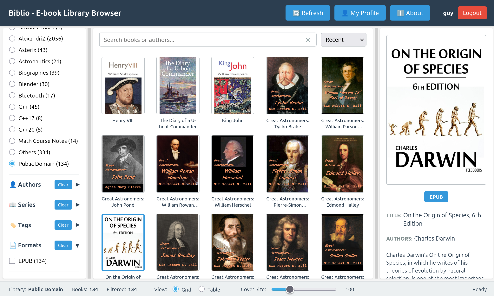

# Biblio - Web-Based E-book Library Browser

A modern web application for browsing multiple Calibre e-book libraries with a responsive panel-based UI.



## Features

- **Multiple Library Support**: Browse multiple Calibre libraries from a single interface
- **Rich Metadata Display**: View detailed information about each book including authors, series, tags, and more
- **Advanced Filtering**: Filter books by authors, tags, and series
- **Search Functionality**: Full-text search across book titles and authors
- **Cover Image Gallery**: Browse book covers in a grid layout with zoom and details
- **Responsive Design**: Works on desktop, tablet, and mobile devices
- **Infinite Scroll**: Efficiently browse large libraries with progressive loading
- **Session Persistence**: Automatically saves your filters, search, and library selection using browser cookies

## Architecture

### Backend (Rust)
- **Framework**: Actix-web - High-performance async web framework
- **Database**: SQLite (Calibre native format) - Direct read access to Calibre databases
- **API**: RESTful API endpoints for library and book operations

### Frontend (Web)
- **HTML5**: Modern semantic markup
- **CSS3**: Responsive grid layouts with flexbox
- **JavaScript**: Vanilla ES6+ for dynamic interactions

## Project Structure

```
biblio/
├── Cargo.toml                 # Rust dependencies and project config
├── src/
│   ├── main.rs              # Application entry point and server setup
│   ├── db.rs                # Calibre database access layer
│   ├── library.rs           # Library discovery and scanning
│   └── api.rs               # REST API endpoint handlers
├── public/
│   ├── index.html           # Main web interface with embedded CSS
│   ├── app.js               # Frontend JavaScript application
│   └── favicon.ico          # App icon (optional)
└── libraries/               # Directory for Calibre libraries (auto-created)
    └── YourLibrary/
        └── metadata.db      # Calibre metadata database
```

## Installation

### Prerequisites

- Rust 1.70+ ([Install Rust](https://rustup.rs/))
- Calibre libraries with `metadata.db` files

### Setup Steps

1. **Clone or extract the project**:
   ```bash
   cd <biblio-parent-folder>/biblio
   ```

2. **Configure the library path**:
   - Copy the configuration example file:
     ```bash
     cp src/config.rs.example src/config.rs
     ```
   - Edit `src/config.rs` and set the `LIBRARY_PATH` to your Calibre libraries directory:
     ```rust
     pub const LIBRARY_PATH: &str = "/path/to/your/calibre-libraries";
     ```
   - **Note**: The `src/config.rs` file is local configuration and should not be committed to version control

3. **Build the application**:
   ```bash
   cargo build --release
   ```

4. **Run the server**:
   ```bash
   cargo run --release
   ```
   
   Or use the pre-built binary:
   ```bash
   ./target/release/biblio
   ```

5. **Access the application**:
   - Open your web browser and go to: `http://localhost:8080`

## Usage

### Main Interface

The application is organized into five panels:

#### Top Panel (Command Bar)
- **Refresh**: Reload the library list and rescan for new libraries
- **Settings**: Configure application preferences (to be implemented)
- **About**: View version and application information

#### Left Panel (Filters)
- **Libraries**: Switch between available libraries
- **Authors**: Filter books by specific authors
- **Tags**: Filter books by subject tags
- **Series**: Filter books by series

#### Center Panel (Books Grid)
- **Search Box**: Search for books by title or author
- **Sort Options**: Sort by recent, title, or author
- **Grid Display**: Visual gallery of book covers with titles
- **Selection**: Click on a book to view detailed information

#### Right Panel (Book Details)
Shows comprehensive information for the selected book:
- Book cover image
- Title and authors
- Series information (if applicable)
- Tags/categories
- Publisher and publication date
- Rating (if available)
- Comments/description

#### Bottom Panel (Status Bar)
- Current library name
- Total number of books
- Number of filtered books
- Current operation status

## API Reference

### Endpoints

#### Libraries
- `GET /api/libraries` - Get list of all available libraries
- `GET /api/libraries/{id}` - Get details of a specific library

#### Books
- `GET /api/libraries/{id}/books` - Get all books in a library
- `GET /api/libraries/{id}/books/{book_id}` - Get details of a specific book
- `GET /api/libraries/{id}/books/{book_id}/cover` - Get cover image for a book

#### Metadata
- `GET /api/libraries/{id}/authors` - Get all authors in a library
- `GET /api/libraries/{id}/tags` - Get all tags in a library
- `GET /api/libraries/{id}/series` - Get all series in a library

#### Query Parameters
- `search`: Filter books by title or author name
- `author_ids`: Filter by author IDs (comma-separated)
- `tag_ids`: Filter by tag IDs (comma-separated)
- `series_ids`: Filter by series IDs (comma-separated)

### Response Format

All API responses follow this format:

```json
{
  "success": true,
  "data": { /* response data */ },
  "error": null
}
```

## Configuration

### Library Path

By default, libraries are loaded from the `./libraries` directory relative to where the binary is run. To use a different path, modify the `libraries_path` in `src/main.rs`:

```rust
let libraries_path = Path::new("./libraries");  // Change this path
```

Then rebuild the application.

### Server Port

The server listens on `0.0.0.0:8080` by default. To change the port, modify `src/main.rs`:

```rust
.bind("0.0.0.0:8080")?  // Change port here
```

## Development

### Build for Development
```bash
cargo build
./target/debug/biblio
```

### Run with Logging
```bash
RUST_LOG=debug cargo run
```

### Run Tests
```bash
cargo test
```

## Database Format

Biblio reads Calibre's SQLite metadata.db files. The main tables accessed are:

- `books` - Book metadata (title, timestamp, etc.)
- `authors` - Author information
- `books_authors_link` - Join table for book-author relationships
- `tags` - Tag/category information
- `books_tags_link` - Join table for book-tag relationships
- `series` - Series information
- `books_series_link` - Join table for book-series relationships

## Performance

- **Library Scanning**: On startup, all libraries are scanned to build an in-memory cache
- **Book Loading**: Initial load of all books happens when a library is selected
- **Filtering**: All filtering is done client-side for instant response
- **Cover Images**: Served directly from Calibre's cache directory

## Browser Support

- Chrome/Chromium 90+
- Firefox 88+
- Safari 14+
- Edge 90+

## Known Limitations

1. **Filter Accuracy**: Tag/Author/Series filters currently use simplified matching
2. **Large Libraries**: Performance may degrade with libraries containing 10,000+ books
3. **Book Formats**: Only displays cover images; doesn't provide access to book files
4. **Read-Only**: Currently read-only access to Calibre libraries (modifications not supported)

## Future Enhancements

- [ ] Advanced filtering with AND/OR logic
- [ ] Book metadata editing
- [ ] Book file access and download
- [ ] User authentication and per-user libraries
- [ ] Dark theme
- [ ] Advanced search with full-text indexing
- [ ] Book recommendations
- [ ] Reading progress tracking
- [ ] Export/Import functionality
- [ ] Mobile app

## Troubleshooting

### Libraries Not Found
- Ensure the `libraries` folder exists and contains Calibre library folders
- Each library folder must contain a `metadata.db` file
- Check file permissions - the application needs read access to these files

### Cover Images Not Showing
- Ensure the `cache/covers/` subdirectory exists in your Calibre library
- Check that cover images are available in your Calibre installation
- Try opening the library in Calibre to verify it's valid

### Port Already in Use
- The default port is 8080. If it's already in use, modify `src/main.rs` and rebuild
- Or use: `lsof -i :8080` to find what's using the port

### Slow Performance
- Reduce the number of books loaded by filtering at startup
- Consider splitting large libraries into smaller ones
- Check system resources (RAM, CPU)

## License

[Specify your license here]

## Contributing

Contributions are welcome! Please feel free to submit issues or pull requests.

## Support

For issues, questions, or suggestions, please contact the development team or open an issue on the project repository.

---

**Version**: 0.1.0  
**Last Updated**: January 2026
